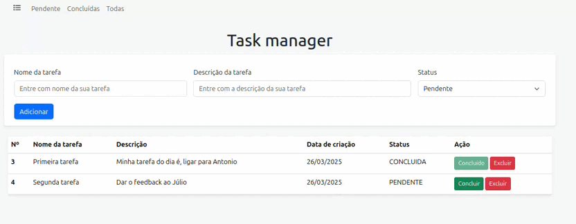
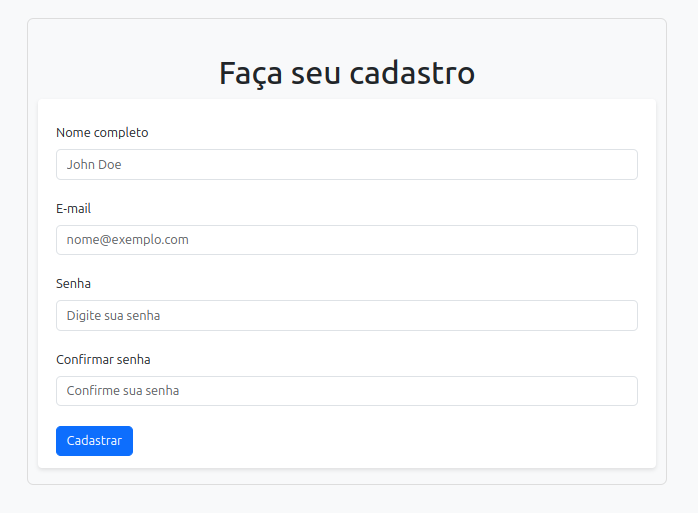
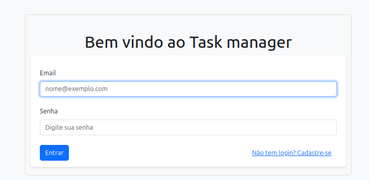
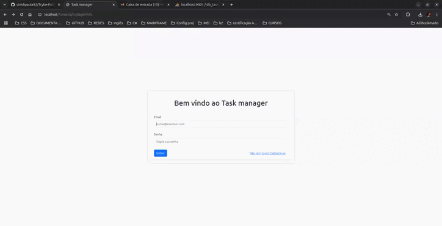

# Seja bem vindo ao projeto Task manager! 

## Stack utilizada

**Back-end:** 
- PHP;
- Slim4;

**Front-end:** 
- HTML
- CSS;
- JavaScript;

  
<strong>👨‍💻 O que foi desenvolvido</strong>

## Layout da página para o usuário

## Layout da página para o Login

O `Task manager` é um site onde você pode criar tarefas e gerenciar o seu dia a dia. Você pode criar, editar e excluir tarefas, além de marcar as tarefas como concluídas.

1. Foi desenvolvo o `Task manager`, onde fiquei responsável por desenvolver uma API e também integrar _- através do docker-compose -_ as aplicações para que elas funcionem consumindo um banco de dados.

2. A API foi desenvolvida com o `PHP` e o `Slim4`, onde implementei as rotas para criar, editar e excluir tarefas. Também implementei a autenticação de usuários, onde o usuário pode se cadastrar e fazer login.

3. O front-end foi desenvolvido com `HTML`, `CSS` e `JavaScript`, onde implementei as páginas para criar, editar e excluir tarefas. Também implementei a página de login, onde o usuário pode se cadastrar e fazer login.

4. O banco de dados foi desenvolvido com o `MySQL`, onde implementei as tabelas para armazenar as tarefas e os usuários.

5. O projeto foi desenvolvido com o `docker`, onde implementei o `docker-compose` para rodar a aplicação e o banco de dados.
 

<strong> Estrutura do projeto</strong>
 

O projeto é composto de 4 entidades importantes na sua estrutura:

1️⃣ **Banco de dados:**

- Container docker MySQL configurado no docker-compose através de um serviço definido como `db_task`;
- Você pode acessar o banco de dados através da URL local: [locahost:9001](http://localhost:9001);
- O banco de dados é inicializado com o nome `tecsatask` e a senha do usuário `root` é `123`;

2️⃣ **Nginx, Back-end e Front-end:**

- Container docker PHP configurado no docker-compose através de um serviço definido como `backend_task`;
- Container docker Nginx configurado no docker-compose através de um serviço definido como `nginx_task`;
- Container docker Front-end configurado no docker-compose através de um serviço definido como `frontend_task`;
- O Nginx é configurado para rodar na porta `80` e ele faz a intermediação entre o front-end e o back-end;

4️⃣ **Docker:**

- O `docker compose` une todos os serviços conteinerizados (backend, frontend e db) e sobe o projeto completo com o comando `docker compose up`;

<strong> ⚠️ Configurações mínimas para execução do projeto</strong>
 

Na sua máquina você deve ter:

- Sistema Operacional Distribuição Unix
- Docker
- Docker-compose versão >=1.29.2

➡️ O`docker compose` deve ter versão igual ou superior à`ˆ1.29.2`:

# Orientações

  
<strong>🐋 Rodando no Docker</strong>

  
  ## 👉 Com Docker
    ### Docker e Docker-compose

⚠ O seu docker-compose precisa estar na versão 1.29 ou superior. ⚠
[Veja aqui a documentação para atualizar o docker compose.](https://docs.docker.com/compose/install/)

- Para rodar o projeto por completo, basta digitar o código em seu terminal `docker compose up -d` na raiz do projeto. O `-d` é para rodar o container em segundo plano.

- Após isso, é só acessar o seu navegador e digitar a URL `http://localhost` para acessar o front-end.

- Realizar o cadastro do usuário, logar e criar as tarefas.

- Segue GIF abaixo da aplicação

<h1 style="center">Obrigado pela visita ao meu repositório</h1>

## 🔗 Links

